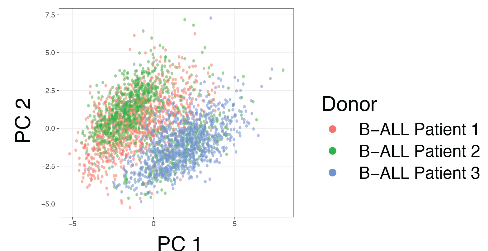
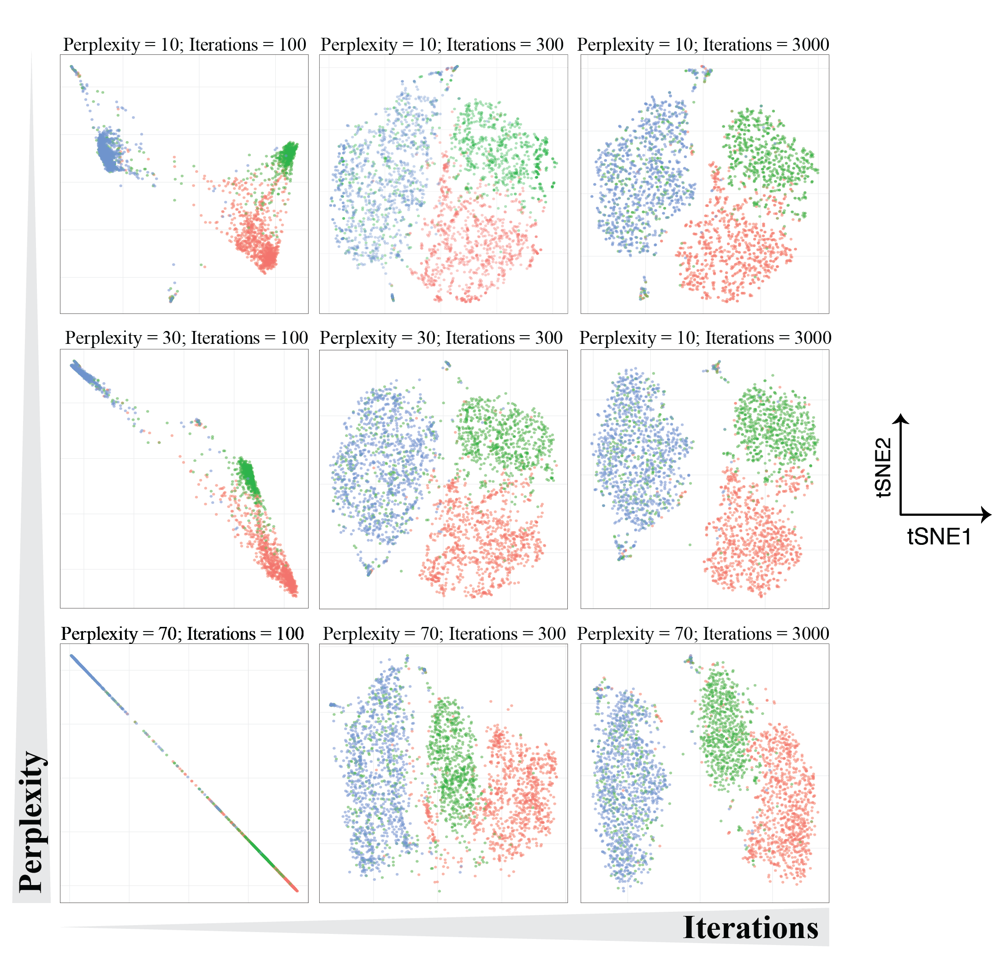
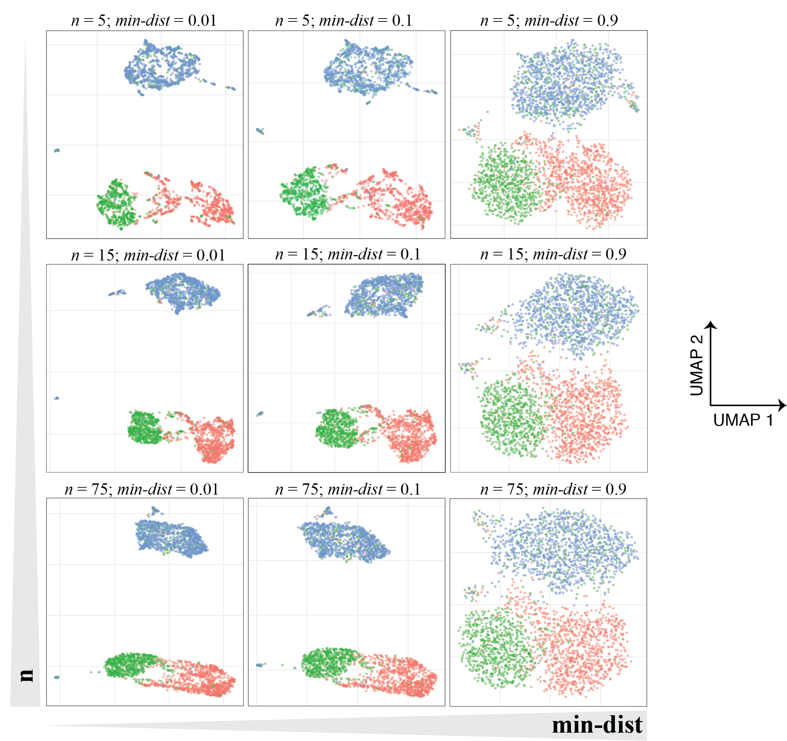

```{r setup, include=FALSE}
knitr::opts_chunk$set(echo = TRUE)
```


Dimensionality reduction is a common method of succinctly visualizing single-cell data either to reveal broad trends in how cells are distributed in high-dimensional space or to roughly assess data quality across multiple experiments or datasets. In this primer, we discuss several methods of dimensionality reduction including Principal component analysis (PCA), t-distributed stochastic neighborhood embedding (tSNE), and uniform manifold approximation and projection (UMAP). Example applications of each of these dimensionality reduction approaches to a [recently-published mass cytometry dataset](https://www.nature.com/articles/nm.4505) are provided in the figures below. 

## Principal Component Analysis (PCA). 

Principal Component Analysis (PCA) is one of the most commonly-used dimensionality reduction techniques and is often the first algorithm applied to new high-dimensional datasets. PCA reduces the dimensionality of an input dataset by recombining its variables into so-called principal components (PCs), a set of new, uncorrelated variables that are rank-ordered by the amount of variance from the original data that they explain. Thus, principal component 1 (PC1) explains the largest amount of variance from the input dataset, principal component 2 (PC2) explains the second largest amount, and so on. Importantly, each principal component represents a linear combination of the original variables and, for cytometry data, can be conceptualized as a composite dimension of markers (or other cellular features) that contain similar information across all of the cells being analyzed.  

In general, PCA is often used to visualize the structure of high-dimensional cytometry data by plotting cells along the first two (or sometimes three) PCs, and this can be useful for observing broad separations in cellular phenotype.  In addition, most statistical software capable of performing PCA will also report the contribution of each individual marker to all of the PCs (called “loadings”). Factor loadings can be helpful in determining which markers contribute most of the variance to a dataset and can be used in preliminary experiments to narrow down an antibody panel for high-dimensional flow cytometry or mass cytometry (for an example of this approach, see [this study](https://doi.org/10.1016/j.cell.2015.05.047)). 

Both because of its rapid compute time (due to its relationship with a linear algebra concept called the singular value decomposition) and lack of tuning parameters, PCA is an exceedingly convenient tool for analyzing broad patterns within a dataset.23 For instance, the EuroFlow Consortium recently used PCA to develop a highly-sensitive method for detecting minimal residual disease in B-cell precursor acute lymphoblastic leukemia (BCP-ALL). In their [study](https://doi.org/10.1111/bjh.14682), bone marrow aspirates from 178 BCP-ALL patients were collected before treatment, after induction therapy, and 1 year after ending treatment and were analyzed using PCA in order to develop an antibody panel that best separated leukemic blasts from healthy B-cell precursors. Yet despite PCA’s usefulness for tasks like this, it also suffers from an inability to meaningfully represent highly complex, nonlinear relationships between variables. Biological data is inherently non-linear because of the complex regulatory structures that abound in molecular biology—including processes like thresholding, saturation, signal amplification, and both positive- and negative-feedback. Thus, biological variables commonly have polynomial, exponential, or otherwise highly complex relationships with one another.  This results in irregular distributions and relationships that may not be easily captured by PCA.  Because of these common properties of biological data, dimensionality-reduction algorithms that can accommodate non-linear relationships are often used to detect more subtle relationships than those represented by PCA.  



## T-distributed Stochastic Neighbor Embedding (tSNE). 
Although PCA is limited to the detection of linear patterns, not all dimensionality reduction algorithms are. The first of the non-linear algorithms we will discuss is t-distributed stochastic neighbor embedding (t-SNE; often also called “viSNE” when used for visualization).  The t-SNE algorithm has been implemented in most programming languages commonly used for scientific computing including R, Python, and MATLAB. In addition, it is available for use as a graphical user interface (GUI) on both the FlowJo and Cytobank analysis platforms. 

Like PCA, t-SNE analyses start with high-dimensional input data in which single cells are associated with corresponding measurements of protein marker expression in flow cytometry, sequence reads in single-cell nucleic acid sequencing, or cellular neighborhood information in multiplexed imaging. However, whereas PCA reduces dimensionality through a series of linear transformations based on the input data’s global variance structure, t-SNE more accurately captures non-linear relationships by emphasizing differences in the data’s local structure.  In brief, it does so in three steps. First, the pairwise distances between individual cells and each of their close neighbors are calculated in high-dimensional space and represented as a set of normal (Gaussian) probability distributions. Second, each cell is placed randomly on a pair of arbitrary axes to give an “initial” 2-dimensional representation of the data in which distances between close neighbors are calculated using the t-distribution.30 And third, the probability distribution of the high-dimensional and initial 2-dimensional representations are compared, and the 2-dimensional representation is iteratively adjusted until it matches the high-dimensional representation as closely as possible. Ultimately, this means that t-SNE analysis places similar cells close to one another in the resulting plot such that distinct cellular subpopulations emerge visually.

Importantly, t-SNE requires the user to set several hyperparameters before an analysis is run—including the algorithm’s number of iterations, learning rate, and perplexity—and these parameters can have significant effects on the final result. Perhaps the most important of these values is “perplexity,” which represents the rough balance between the input data’s local and global structure that is emphasized in the construction of t-SNE’s low-dimensional representation. When perplexity is low, each data point is assumed to have a small number of close neighbors and local structure predominates; when perplexity is high, the opposite is true.  Thus, a recommended best practice for conducting a t-SNE analysis is to test a variety of perplexity values (keep in mind that the recommended range is 5-50) on a given dataset and observe which underlying patterns in the data are consistently observed. In addition, it is important to test multiple values for the number of iterations that the algorithm will use when constructing the low-dimensional representation, as values that are too low will fail to represent the data accurately. Importantly, several variations on the t-SNE algorithm—including [hierarchical tSNE (HSNE)](https://doi.org/10.1038/s41467-017-01689-9)  and [opt-SNE](https://doi.org/10.1038/s41467-019-13055-y) have been developed since its initial description to improve its accuracy and compute time on large datasets. 

t-SNE has been successfully applied to variety of high-dimensional cytometry datasets in the study of human cancer. For example, in t-SNE’s initial application to cytometry data, [Amir et al.](https://doi.org/10.1038/nbt.2594) used it to show that bone marrow aspirates taken from acute myeloid leukemia (AML) patients contain cells distinct from both healthy bone marrow populations and one another. More recently, t-SNE analysis has been used in multiple studies characterizing the differences between circulating and infiltrating immune cell populations in patients with solid tumors. For example, [one recent study](https://doi.org/10.1073/pnas.1706559114) applied t-SNE analysis to mass cytometry data acquired from hepatocellular carcinoma (HCC) patient biopsies to show that immune cells within the HCC tumor microenvironment express higher levels of immunosuppressive surface markers than those outside the tumor. Specifically, the authors were first able to identify subsets of tissue resident memory CD8+ T-cells and T-regulatory cells (T-regs) expressing high levels of T-cell exhaustion markers—including PD-1, Tim-3, and Lag-3—after these cells segregated from other cell types on a series of t-SNE plots. Furthermore, a [similar approach](https://doi.org/10.1172/jci.insight.85935) demonstrated a nearly identical result in a recent study of glioblastoma multiforme (GBM), in which t-SNE analysis helped to identify GBM tumor-resident T-regs cells that, when compared to T-regs in circulation, demonstrated both higher PD-1 expression and an elevated molecular signature of T-cell exhaustion.  Together, these examples indicate that t-SNE can be especially useful during the exploratory phase of data analysis by parsing out broad population dynamics and standout cellular subsets on easily-visualized, low-dimensional plots. 

Yet, while t-SNE is a powerful tool for representing high-dimensional, non-linear patterns in two or three dimensions, it can be easy to misinterpret. Even when t-SNE’s tunable parameters are appropriately set, the algorithm does not preserve density or global distances between observations. This means two important things. First, it means that the relative size of a subpopulation on a t-SNE plot does not necessarily correspond to its actual size in high-dimensional space. Second, it means that the distance between distant “clusters” in a t-SNE plot does not always accurately reflect their similarity to one another. Thus, interpreting distances on a t-SNE plot quantitatively can be misleading, although [some studies](https://doi.org/10.1371/journal.pone.0153207) have precariously done so to make claims regarding leukemic cell identity along the hematopoietic developmental trajectory.  Importantly, it should also be noted that t-SNE is stochastic, which means that it can yield slightly different low-dimensional representations when applied to the same data multiple times, although differences tend to be minor when the algorithm’s parameters are chosen well. Here is a visualization of how the same observations can be visualized differently using different t-SNE hyperparameters: 



## Uniform Manifold Estimation and Projection (UMAP).

While t-SNE is the most commonly used non-linear dimensionality reduction technique in high-dimensional cytometry data analysis, it is limited to analyzing a relatively small number of cells due to its slow computation time (which scales quadratically with the number of cells being analyzed).  Due to this and other constraints on t-SNE’s performance, an algorithm called Uniform Manifold Approximation and Projection (UMAP) was recently developed as an alternative dimensionality reduction approach. Because UMAP was so recently developed, there are limited examples of its application to the study of cancer biology specifically; however, UMAP is becoming increasingly widespread in the field of bioinformatics in general, which is why it warrants discussion here. UMAP has been implemented as software packages in both Python and R. 

Like t-SNE, UMAP seeks to represent the high-dimensional structure of an input data matrix in low-dimensional space such that local relationships between nearby cells are conserved. Unlike t-SNE, however, UMAP leverages manifold theory and Riemannian geometry to accomplish this by first approximating the high-dimensional surface on which the data sits, then utilizing a weighted k-nearest neighbor graph architecture to project that surface onto a low-dimensional layout. While UMAP is derived using mathematical theory that most biologists will be unfamiliar with, in practice UMAP and tSNE can be used for similar purposes. UMAP’s particular strengths derive from its significantly faster compute time and greater emphasis on global data structure relative to t-SNE, as well as its ability to add new observations to an existing plot, of which t-SNE is not directly capable. This ability to embed additional data points on an existing plot is particularly useful for biological data analysis, as it has direct applications in longitudinal disease monitoring (i.e. tracking individual patients over time throughout disease progression or treatment) as well as in the detection of batch effects when new samples are analyzed. Importantly, UMAP’s greater preservation of a dataset’s global structure means that comparing distances between clusters on a UMAP embedding might be a bit more meaningful than doing so on a t-SNE plot.  However, because local distances are used to compute both t-SNE and UMAP embeddings, global distances (particularly between very distant data points) are difficult to interpret. In most cases, it is less precarious to simply compute distances in the original, high-dimensional data space, making use of the distance metric that best suits your particular dataset.

UMAP requires the user to tune several hyperparameters, including n, the number of neighbors that UMAP will use to learn local data structure; d, the target number of output embedding dimensions; min-dist, the minimum distance allowed between close points in the low-dimensional representation; and n-epochs, the number of iterations the algorithm should use to find a stable low-dimensional representation. Arguably the most important of these parameters is n, for which larger values will emphasize global data structure over local structure. By contrast, min-dist is a purely aesthetic parameter for which low values will result in more closely-packed plots. In general, users should expect to test a variety of values for n and min-dist while using values of d and n-epochs that provide stable output in the desired number of dimensions (generally 2 or 3). Example visualizations of UMAP with different hyperparamter choices are shown below (using the same dataset from the two figures above).



## PCA, t-SNE, or UMAP?

When choosing between PCA, t-SNE, and UMAP in practice, there are several considerations to keep in mind. For instance, PCA is an optimal choice when computational speed, interpretability and simplicity (due to PCA’s lack of hyperparameters) are important. By contrast, t-SNE and UMAP are stronger choices when an analysis requires the visual separation of cell types whose measurements have highly non-linear relationships with one another or whose differences are poorly resolved using PCA in 2 or 3 dimensions. Finally, longitudinal data analyses are best performed using PCA and UMAP due to their ability to embed new samples into a coordinate system that has already been computed on previous samples, thereby allowing the direct comparison of old and new data. That being said, outside of these specific criteria, many data scientists also choose between these dimensionality reduction methods using trial-and-error—generally by starting with PCA due to its speed and working up to slower, more complex methods like UMAP and t-SNE if necessary. 
